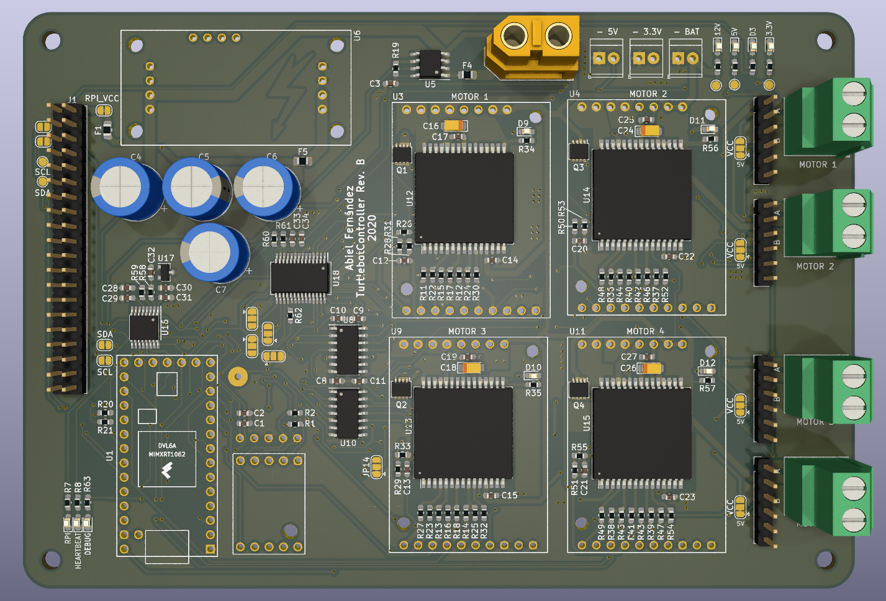

## Robotto PCB
PCB board designed to control a small, four wheeled robot, using a Teensy 4.0 as the main controller.

  

## Features
- Uses a `Teensy 4.0` or a `Teensy 4.1` (without soldering in the extra headers)
- 4 VNH5019A drivers
- Support for 5V or 3.3V encoders
- Raspberry PI GPIO compatible header
- Current and voltage monitoring
- Support for adding an IMU

## Warning!
This board has several known issues, further revisions to the PCB design have to be made.
